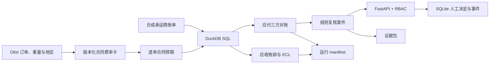

# 物流结算异常复核与应收风险监测

一个以可复核证据为核心的财务数据项目。系统在 Olist 公开电商数据上构造承运商结算场景，使用 DuckDB SQL 完成应付侧三方对账，并以独立模块计算应收账龄、DSO 与 ECL 指标。FastAPI 复核台只提供建议、证据和人工决定记录，不提供付款、退款、追款或开票执行接口。


- [交互异常复核台](docs/copilot.html)：可输入合同应付、服务区域、计费重量与账单模拟数据，运行规则识别、人工决定并导出 JSON 证据轨迹
- [分析看板](docs/settlement_dashboard.html)：对账分布、账龄结构和重点异常
- [控制工作流](docs/ai-pm/CONTROLLED_WORKFLOW.md)
- [评估与 Bad Cases](docs/ai-pm/EVALUATION_AND_BAD_CASES.md)

## 模块边界

| 模块 | 核心问题 | 主要产出 | 不做什么 |
|---|---|---|---|
| 应付结算对账 | 承运商账单是否与版本化合同费率、逐单计费重量和履约证据一致 | 合同条款、匹配结果、6类异常、金额影响、证据包 | 不发起付款、拒付或追款 |
| 应收风险监测 | 未结应收的账龄、DSO 与预期信用损失如何变化 | 五档账龄、客户暴露、ECL、坏账候选 | 不替代会计判断或形成正式审计结论 |

两个模块共享数据加载、报表和运行血缘设施，但不混用业务结论。注入的异常标签只在规则执行完成后用于离线评估，不进入 SQL 判定或案件建议链路。

## 已实现控制

- 三方对账：72 条版本化承运商费率（8 家承运商 × 3 服务区 × 3 重量带）先计算逐单合同预期金额，再与履约证据和账单比对；识别超额、少计、重复、幽灵、未送达计费和漏计 6 类异常。
- 合同证据：案件和证据包同时给出费率卡版本、合同条款号、服务区、计费重量、合同预期金额和原始 Olist 运费，金额判定只依据合同预期。
- 规则为准：案件结论来自确定性规则；LLM 仅在显式配置密钥后生成受约束摘要，输出需通过 Schema、证据引用和规则一致性校验。
- 人工决定不可覆盖：`PENDING → APPROVED / REJECTED / ESCALATED` 通过 SQLite 事务写入；相同幂等键可安全重放，不同请求不能覆盖首条决定。
- 身份与权限：生产式运行可通过 `REVIEW_API_KEYS` 配置 viewer/reviewer/admin；审阅人与角色由认证身份写入，不能由请求正文冒充。未配置时仅进入明确标识的本地 demo 模式。
- 数据库迁移：SQLite 使用 `schema_migrations` 维护版本，旧库可补加身份角色字段。
- 事件留痕：案件打开、模型复核和人工决定记录演员/会话、时间与元数据。
- 证据包：`GET /cases/{case_id}/evidence-bundle` 导出源记录、规则结论、人工决定、事件时间线、规则及输入文件哈希。
- 运行血缘：每次完整流水线生成 `output/run_manifest.json`，保存 `run_id`、UTC 时间、策略版本、输入/规则 SHA-256、表行数和评估结果。
- 资金执行禁用：健康检查、案件响应和证据包均明确返回 `financial_execution: disabled`。

## 评估设计

`src/run_pipeline.py` 将注入真值与规则输出在执行后合并，生成：

- 全量集与确定性 20% 留出集的 Precision、Recall、F1、False Positive Rate；
- 各异常类别的 Precision、Recall、F1 与样本量；
- 逐案评估明细 `output/recon_evaluation.csv`；
- 汇总结果 `output/recon_evaluation_summary.json`。

当前全量运行中，99,418 条评估记录的异常召回率为 100%、Precision 为 99.955%；确定性 20% 留出集的 Precision 与 Recall 均为 100%。这些数值来自注入真值的模拟验证，不代表真实生产环境准确率；每次运行都会把完整指标和数据哈希写入 manifest。

规则与安全回归还包括 21 条非重复金标案例、10 条 Bad Case、4 条模型护栏场景，以及 API/存储/评估自动化测试。

## 架构



分析层使用 DuckDB 处理批量 SQL；操作层使用 SQLite 保存需要事务、一致性和幂等约束的人工决定与事件，两者职责分离。

## 目录

```text
src/
  fetch_olist.py          获取 Olist 原始数据
  generate_data.py        生成承运商账单与应收台账
  run_pipeline.py         跑 SQL、导出报表、评估并生成 manifest
  audit_agent.py          回溯证据并生成规则建议
  model_review.py         可选模型摘要与护栏
  operational_store.py    SQLite 决定与事件存储
  security.py             API key 身份与角色权限
  copilot_api.py          案件、证据包、决定、事件与指标 API
  evaluate_copilot.py     金标、Bad Case 与模型护栏评估
sql/
  02_three_way_match.sql  应付三方对账
  03_ar_aging.sql         应收账龄、DSO 与 ECL
eval/                     冻结评估样本
tests/                    单元与 API 集成测试
docs/                     复核台、看板与控制文档
output/                   本地生成物（不入库）
```

## 运行

```bash
pip install -r requirements.txt
python src/fetch_olist.py
python src/generate_data.py
python src/run_pipeline.py
python src/audit_agent.py --top 25
python src/evaluate_copilot.py
```

启动本地复核台：

```bash
uvicorn src.copilot_api:app --reload
python -m http.server 8080 -d docs
```

浏览器打开 `http://localhost:8080/copilot.html?api=http://localhost:8000`。

容器化启动（首次会下载公开数据并跑完整流水线）：

```bash
# PowerShell 示例：生产式本地演示必须设置非空 API key 映射
$env:REVIEW_API_KEYS='{"review-key":{"actor_id":"reviewer-01","role":"reviewer"}}'
docker compose up --build
```

调用受保护接口时传 `X-API-Key: review-key`。不设置 `REVIEW_API_KEYS` 时，
`/health` 会返回 `authentication: demo`，仅用于本机演示。

运行自动化测试：

```bash
pip install -r requirements-dev.txt
pytest -q
```

## 关键接口

| 方法 | 路径 | 说明 |
|---|---|---|
| GET | `/cases` | 查询待复核案件 |
| GET | `/cases/{case_id}` | 查看案件和证据摘要 |
| GET | `/cases/{case_id}/evidence-bundle` | 下载可归档 JSON 证据包 |
| POST | `/cases/{case_id}/model-review` | 可选受控模型摘要 |
| POST | `/cases/{case_id}/human-decision` | 保存不可覆盖的人工决定 |
| POST | `/events` | 记录产品审计事件 |
| GET | `/metrics/summary` | 查看决定分布和 API 时延 |

## 数据与结论边界

Olist 是公开电商数据；合同费率、承运商账单、回款与异常均为固定规则或固定随机种子生成的模拟数据。这里的“合同价”指仓库内可追溯的合成费率卡，不代表 Olist 或真实承运商合同。项目展示控制设计、数据处理和验证方法，不声称接入银行或企业生产系统，也不输出正式审计意见。
