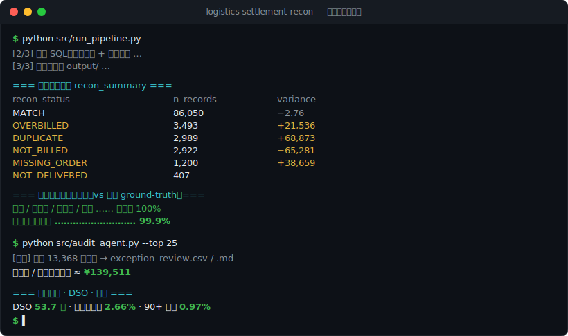

# 物流结算异常复核 Copilot
**Controlled Logistics Settlement Reconciliation & AR-Aging Copilot**

一个端到端的**财务结算运营**工具：在真实电商物流数据上，用 **SQL(DuckDB) + Python** 实现
①承运商账单**三方自动对账**（识别金额错配/重复/幽灵单/未送达计费/漏计）
②**应收账款账龄分析**（五桶 + DSO）
③**坏账(ECL)计提**（账龄率矩阵）
④受控的**异常复核 Copilot**（证据回溯、规则建议、人工审批、审计记录）
并用注入的 ground-truth 验证对账引擎**异常识别查全率 ≈ 99.9%**。



> 🧭 **可交互 MVP**：[docs/copilot.html](docs/copilot.html)（异常队列、证据账本、建议与人工审批；GitHub Pages 可直接演示）

> 📊 **分析看板**：[docs/settlement_dashboard.html](docs/settlement_dashboard.html)（KPI 卡片 + 对账分布 + 账龄柱状 + Top 异常，可打印 PDF）

> 📄 **AI 产品交付物**：[PRD](docs/ai-pm/PRD.md) · [受控工作流](docs/ai-pm/CONTROLLED_WORKFLOW.md) · [Prompt 规格](docs/ai-pm/PROMPT_SPEC.md) · [模型选型](docs/ai-pm/MODEL_SELECTION.md) · [用户研究计划](docs/ai-pm/USER_RESEARCH_PLAN.md) · [评测与 Bad Case](docs/ai-pm/EVALUATION_AND_BAD_CASES.md)

> 面向岗位：京东物流「财务结算运营（Bill Reconciliation & Settlement）」实习。项目职责一一对应对账、异常处理、应收账龄、坏账监控、结算自动化、数据分析报表。

---

## 为什么这么设计
真实数据里没有"带错误的承运商账单"。本项目用 **Olist 巴西电商公开数据集**（10 万+ 订单，含
`freight_value` 运费、`seller_id`、`order_status`、送达时间戳）作为**系统应计运费(SOR)**这一"真值"，
再据此**合成一份承运商账单并注入 5 类已知差异**——因此对账引擎抓到的每一条异常都能与注入真值比对，
量化"异常识别覆盖率"。应收账龄则把每个卖家视为 **B2B 客户**按月开票并模拟回款。

数据集：[Olist (Kaggle)](https://www.kaggle.com/datasets/olistbr/brazilian-ecommerce)　对账分类逻辑参考 [Enterprise Finance Reconciliation Tool](https://github.com/MuhannadRVD/-Enterprise-Finance-Reconciliation-Tool-Python-Automation)。

## 目录结构
```
logistics-settlement-recon/
├── src/
│   ├── fetch_olist.py       # ① 拉取 Olist 原始 CSV → data/raw/
│   ├── generate_data.py     # ② 由 SOR 合成承运商账单(注入差异) + AR 台账 → data/generated/
│   ├── run_pipeline.py      # ③ 载入 DuckDB → 跑 SQL → 导出报表 → 验证查全率
│   ├── audit_agent.py       # ④ 证据回溯 + 受控建议（规则引擎，可选 LLM 摘要）
│   ├── model_review.py      # ⑤ 结构化模型输出 + 证据/规则一致性护栏
│   ├── copilot_api.py       # ⑥ 案件、模型摘要、指标与幂等人工审批 API
│   └── evaluate_copilot.py  # ⑦ 规则回归 + Bad Case + 模型护栏评测
├── sql/
│   ├── 01_setup.sql             # 基表载入(独立跑参考)
│   ├── 02_three_way_match.sql   # ③ 三方对账引擎
│   └── 03_ar_aging.sql          # ③ 账龄 + DSO + 坏账 ECL 计提
├── data/{raw,generated}/    # 数据(不入库，脚本可重建)
├── eval/                    # 合成金标集 + Bad Case 安全测试
├── tests/                   # pytest 单元与 API 集成测试
├── .github/workflows/       # GitHub Actions 自动验证
├── docs/ai-pm/              # PRD、工作流、评测设计
├── output/                  # 报表产物(CSV + settlement_report.xlsx + 人工审批记录)
├── requirements.txt
└── README.md
```

## 一键运行
```bash
pip install -r requirements.txt
python src/fetch_olist.py        # 拉 Olist 数据(~46MB)
python src/generate_data.py      # 生成承运商账单 + AR 台账(固定随机种子，可复现)
python src/run_pipeline.py       # 跑对账 + 账龄，导出 output/ 并打印验证
python src/audit_agent.py --top 25   # 生成受控建议；所有资金相关操作仍须人工审批
python src/evaluate_copilot.py       # 金标回归 + Bad Case 安全兜底评测
pip install -r requirements-dev.txt && pytest -q  # 自动化测试
uvicorn src.copilot_api:app --reload # 可选：启动本地 API；打开 docs/copilot.html?api=http://localhost:8000
python -m http.server 8080 -d docs  # 可选：本地打开交互页（http://localhost:8080/copilot.html）
```

## 三方对账引擎（`sql/02_three_way_match.sql`）
三方 = ①系统应计运费 SOR　②送达确认（订单状态/送达时间）　③承运商账单。逐笔全外连接后判定：

| 判定 | 含义 | 处理优先级 |
|---|---|---|
| `MATCH` | 账单与系统一致（±2% 容差内） | P0 |
| `OVERBILLED` / `UNDERBILLED` | 金额超出容差 | P2 复核 |
| `DUPLICATE` | 同单重复计费 | P1 拒付重复部分 |
| `MISSING_ORDER` | 幽灵单：账单有、系统无对应订单 | P1 拒付 |
| `NOT_DELIVERED` | 计费但服务未发生（未送达） | P1 拒付 |
| `NOT_BILLED` | 漏计：系统已送达、账单未收到 | P3 催承运商开票/确认成本 |

**实测结果（Olist 全量，99,485 条账单）：**
```
recon_status   n_records  pct   total_variance
MATCH             86,050  85%          −2.76
OVERBILLED         3,493  3.4%    +21,536   ← 多付给承运商，应追回
DUPLICATE          2,989  3.0%    (重复计费 ~68,872 应拒付)
NOT_BILLED         2,922  2.9%    −65,281   ← 已送达未入账的应付成本
UNDERBILLED        2,357  2.3%    −14,730
MISSING_ORDER      1,200  1.2%    +38,659   ← 幽灵计费，应拒付
NOT_DELIVERED        407  0.4%    (计费未送达，应拒付)
```
**对账引擎验证查全率（对比注入 ground-truth）：DUPLICATE / MISSING_ORDER / NOT_DELIVERED / NOT_BILLED = 100%，金额错配 99.7%，异常总体 99.9%。**

## 应收账款账龄 + DSO + 坏账（`sql/03_ar_aging.sql`）
以最新发票月为快照，未结应收按逾期天数分五桶，套用 **ECL 账龄率矩阵**计提坏账。
> ECL 率（0.9% / 15.6% / 44.2% / 100%）**参照京东物流 2024 年报附注披露**——与本人所做行研报告互相印证。

产出：`ar_aging_summary`（五桶金额/占比/计提）、`ar_kpi`（DSO、加权坏账率）、
`bad_debt_candidates`（90+ 逾期催收清单）、`ar_by_client`（按客户应收暴露）。

**实测结果（校准为健康账簿）：**
```
账龄桶     占比      ECL率     计提
Current  89.4%    0.9%
1-30      5.9%    0.9%
31-60     2.8%   15.6%
61-90     0.9%   44.2%
90+       1.0%    100%
——————————————————————————————
DSO = 53.7 天 | 加权坏账率 = 2.66% | 90+ 占比 0.97% | 近 365 天已核销坏账 ≈ 3.6 万
```
> **对标京东物流**（DSO≈31 天、加权 ECL 1.8%、90+ 占 1.1%）：本合成账簿处于健康区间，DSO 略高、
> 指向"催收/账期治理仍有改善空间"——正是结算运营岗的价值切口。

## 受控异常复核 Copilot（`src/audit_agent.py` + `src/copilot_api.py`）
对账引擎只"发现"异常，Copilot 负责整理证据和给出**建议**，由结算人员完成最终处置：
1. **金额-单据溯源**：对每条异常，从承运商账单金额回溯到系统 `order_items` 逐笔运费、订单状态/承运/签收时间戳、
   容差规则，拼出完整**证据链（audit trail）**——即"这笔钱能否对上单据"。
2. **受控建议**：基于证据链给出 **裁定**（CONFIRMED/SUSPECT/PASS）+ **建议动作**（拒付整笔/拒付重复部分/追回差额/催开票/人工复核）+ 依据 + 置信度；证据缺失或冲突时强制回退人工复核。
3. **按需结构化模型摘要**：`POST /cases/{case_id}/model-review` 将限定证据交给模型；输出必须通过 Pydantic Schema、证据 ID、规则裁定/动作和置信度校验，否则明确回退规则理由。无密钥时返回 `disabled`，不静默伪装成模型已启用。
4. **人工审批与审计**：审核人和备注由用户填写；`POST /cases/{case_id}/human-decision` 使用幂等键，只允许 `PENDING → APPROVED/REJECTED/ESCALATED`，不能覆盖首条决定。API 没有支付、退款、追回或催票端点。
5. **指标与回归**：记录案件打开、模型请求/完成和人工决定事件；汇总采纳率与 API P95，并通过 21 条非重复规则回归、10 条安全案例、4 类模型护栏及 pytest/CI 阻止回归。

**规则建议结果（13,368 条异常全部生成建议，最终处置仍需人工审批）：**
```
裁定         建议动作            笔数     金额影响
CONFIRMED   拒付整笔(幽灵单+未送达)  1,607    49,103   ← 直接拒付
CONFIRMED   拒付重复部分           2,989    68,873
CONFIRMED   追回差额(超额计费)       3,493    21,536   ← 向承运商追回
SUSPECT     人工复核/确认成本(少计)   2,357   −14,730
SUSPECT     催承运商开票/确认应付(漏计) 2,922   −65,281
—————————————————————————————————————————————————————
模拟账单中的潜在拒付/追回金额合计 ≈ 139,511；另有 6.5 万漏计应付需催票入账
```
产出：`exception_review.csv`（全部异常的结构化建议）+ `exception_review.md`（Top-N 人读审计备忘，逐条含溯源证据链）+ `human_decisions.csv`（人工审批记录，仅在本地 API 操作后生成）。

## 技术栈与 JD 对应
| JD 要求 | 本项目对应 |
|---|---|
| Reconciliation / Exception handling | 三方对账引擎 + 异常清单(带优先级/金额影响) |
| AR aging / Bad-debt monitoring | 五桶账龄 + DSO + ECL 计提 + 坏账候选清单 |
| SQL / Python / Excel / Power BI | DuckDB SQL(CTE/窗口函数/全外连接) + Python 流水线 + Excel 报表(可接 Power BI) |
| Process optimization / automation | 全流程脚本化、一键复现，替代人工逐笔核对 |
| Data analysis & reporting | 汇总表 + 多 sheet Excel 报表 |

## 简历 bullet（示意）
> **物流结算异常复核 Copilot（个人产品项目）** — 基于 Olist 10 万+ 电商订单，用 **DuckDB SQL** 构建
> 订单×承运商×合同容差的**三方对账引擎**，自动分类匹配/超额/重复/幽灵单/未送达/漏计并输出带优先级的
> 异常清单，注入真值验证**异常识别查全率 99.9%**；用 **Python** 搭建**应收账款五桶账龄 + DSO + 坏账 ECL 计提**（ECL 率对标京东物流年报），
> 生成坏账候选与按客户应收暴露报表；设计“规则裁定—证据摘要—人工审批—审计回写”的受控复核流程，开发 FastAPI API 与可交互前端，
> 对证据缺失或冲突案件强制转人工；在模拟账单中识别潜在拒付/追回金额约 14 万，所有资金处置均保留人工确认。

## 已知 TODO（下一版）
- ✅ **回款模型校准（已完成）**：引入"核销出账"逻辑，DSO/90+/加权坏账率已落到健康区间（见上）。
- 完成 5–8 位真实结算人员访谈并更新 PRD；在独立标注冻结集上比较候选模型。
- 增加合同费率卡（按重量×距离）的第三方基准校验；接 Power BI 看板。
