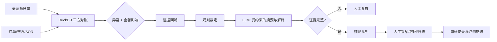

# 受控工作流与安全边界

## 职责划分

| 层 | 负责内容 | 不负责内容 |
|---|---|---|
| DuckDB/规则 | 金额比对、容差、异常分类与优先级 | 自然语言解释、资金执行 |
| 证据层 | 拉取订单、签收、账单和 SOR 组成案件上下文 | 猜测缺失证据 |
| LLM（可选） | 将已验证证据压缩为结构化理由与审核摘要 | 改写金额、绕过规则、执行资金操作 |
| 人工审核 | 采纳、驳回、升级与最终业务动作 | 把低置信度建议直接批量放行 |

## 状态与审计字段

`case_id`、`recon_status`、`evidence_summary`、`recommended_action`、`confidence`、`requires_human_approval=true`、`auto_execution_allowed=false`、`policy_version`、`reviewer`、`human_decision`、`recorded_at`。

该设计刻意**不使用长期用户记忆**：本场景是以单笔账单案件为单位的高风险工作流，持久化“偏好记忆”既不必要，也可能把过期规则带入新案件。可复用的内容应以版本化政策、合同规则和审计记录管理。

## API 与前端边界

`src/copilot_api.py` 只提供案件查询及人工决定记录；它没有支付、退款、催票或追回端点。`POST /cases/{case_id}/human-decision` 仅写入本地审计 CSV，返回值也明确标记 `execution: disabled`。
