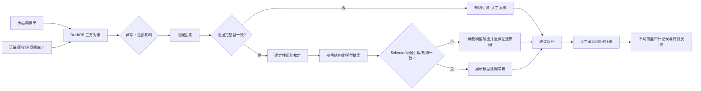

# 受控工作流与安全边界


```mermaid
flowchart LR
    A[承运商账单] --> B[DuckDB 三方对账]
    C[订单/签收/合同费率卡] --> B
    B --> D{异常 + 金额影响}
    D --> E[证据回溯]
    E --> F{证据完整且一致?}
    F -- 否 --> I[规则回退: 人工复核]
    F -- 是 --> G[确定性规则裁定]
    G --> H[按需结构化模型摘要]
    H --> M{Schema/证据引用/规则一致?}
    M -- 否 --> N[屏蔽模型输出并显示回退原因]
    M -- 是 --> O[展示模型证据摘要]
    I --> J[建议队列]
    N --> J
    O --> J
    J --> K[人工采纳/驳回/升级]
    K --> L[不可覆盖审计记录与评测反馈]
```

## 职责划分

| 层 | 负责内容 | 不负责内容 |
|---|---|---|
| DuckDB/规则 | 按 72 条合同费率算逐单应付，再做金额比对、容差、异常分类与优先级 | 自然语言解释、资金执行 |
| 证据层 | 拉取订单、签收、账单、合同条款与费率卡版本组成案件上下文（SOR 只作参照） | 猜测缺失证据 |
| 模型摘要（按需） | 将已验证证据压缩为结构化解释并引用证据 ID | 改写金额、规则裁定/动作/置信度或执行资金操作 |
| 人工审核 | 采纳、驳回、升级与最终业务动作 | 把低置信度建议直接批量放行 |

## 状态与审计字段

案件（`output/exception_review.csv`）：`case_id`、`recon_status`、`contract_expected_freight`、`contract_clause_id`、`rate_card_version`、`billed_total`、`impact_amount`、`verdict`、`recommended_action`、`confidence`、`rationale`、`requires_human_approval=true`、`auto_execution_allowed=false`、`policy_version`、`model_output_role`。

人工决定（SQLite `output/operational.sqlite3` 的 `human_decisions` 表）：`case_id`（唯一）、`recorded_at`、`reviewer`、`actor_role`、`human_decision`、`notes`、`recommended_action`、`impact_amount`、`policy_version`、`idempotency_key`（唯一）、`previous_state`、`new_state`。模型摘要另记 provider、模型 ID、`prompt_version`、时延与 Token（见 PROMPT_SPEC §5）。

案件状态机仅允许：

```text
PENDING → APPROVED
PENDING → REJECTED
PENDING → ESCALATED
```

同一个 `idempotency_key` 重试会返回原结果；案件已有决定时，其他键不能覆盖首条审计记录。写入走 SQLite `BEGIN IMMEDIATE` 事务，`case_id` 与 `idempotency_key` 均为唯一键，冲突返回 409。

`case_id` 按影响金额降序、再按 `order_id`／`seller_id` 稳定排序编号（v0.3.2 起），同一输入重跑编号不变，已存的人工决定不会对到别的案件。

该设计刻意**不使用长期用户记忆**：本场景是以单笔账单案件为单位的高风险工作流，持久化“偏好记忆”既不必要，也可能把过期规则带入新案件。可复用的内容应以版本化政策、合同规则和审计记录管理。

## API 与前端边界

`src/copilot_api.py` 提供案件查询、按需模型摘要、产品事件和人工决定记录；它没有支付、退款、催票或追回端点。查询类接口对 viewer／reviewer／admin 开放，模型摘要、人工决定与产品事件只允许 reviewer／admin 调用。`POST /cases/{case_id}/human-decision` 写入本地 SQLite 审计库，返回值明确标记 `execution: disabled`。`POST /cases/{case_id}/model-review` 用请求 ID 在同一进程内去重、防止重复扣费，同一请求 ID 用于其他案件时返回 409，并始终声明规则是建议来源。
